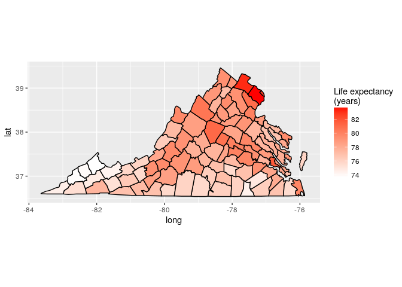
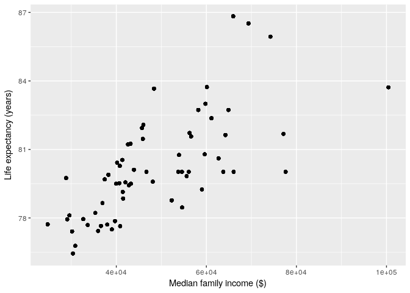

Introduction
============

My `R` skills have atrophied and need practice. I'm going to run through a simple tutorial that renders US county map information with other demographic data from the Census Bureau. Motivated by [literate programming](https://en.wikipedia.org/wiki/Literate_programming) and [science reproducibility](http://kbroman.org/knitr_knutshell/pages/reproducible.html), this tutorial is built into an R-markdown document. You, too, can download and compile this file into HTML.

Requirements
============

This tutorial requires the `ggplot2` and `maps` packages.

Building
========

I have included a `makefile` in this project that will compile the `Rmd` to produce a new markdown file, `readme.md`. This file can be consumed by `GitHub`.

    >>> cd r_map_and_census_tutorial
    >>> make

Load the data
=============

The map data defining the borders of each county of the USA is available in the `maps` R package. I'm going to overlay some demographic information that is available from the Census Bureau (<https://www.census.gov/data.html>). The information currently lives in two tab-delimited files. Let's load them (and the county polygon data).

``` r
map.county <- map_data("county")
life.expectancy.county <- read.csv("data/usa_county_life_expectancy.tsv", sep = "\t")
poverty.county <- read.csv("data/usa_census_poverty_data.tsv", sep = "\t")
```

Render the data
===============

First let's pull out the polygon data for Colorado and render it using `geom_polygon`.

``` r
ggplot() + geom_polygon(data = subset(map.county, region == "colorado"), aes(x = long, 
    y = lat, group = group), fill = "white", color = "black") + coord_fixed(1.3)
```


How about Virginia?

``` r
ggplot() + geom_polygon(data = subset(map.county, region == "virginia"), aes(x = long, 
    y = lat, group = group), fill = "white", color = "black") + coord_fixed(1.3)
```


Merge data for each county
==========================

Let's first integrate the census data. The easiest way to join this data is with the Federal Information Processing Standards (FIPS) code. This, in turn, can be pulled out of the `county.fips` data in the `maps` package.

``` r
data.county <- map.county
data.county$polyname <- paste(data.county$region, data.county$subregion, sep = ",")
data.county <- merge(data.county, county.fips, by = "polyname")
data.county <- merge(data.county, poverty.county, by.x = "fips", by.y = "STCOU")
```

Now let's add the life expectancy county information. We need to massage the data a bit to get the 2014 life expectancy in years.

``` r
data.county <- merge(data.county, life.expectancy.county, by.x = "fips", by.y = "FIPS")
life.expectancy.split.fn <- function(val) {
    #' Breaks apart life expectancy data in () format. Returns the amount in years (as int).
    as.numeric(strsplit(val, "[ (]")[[1]][[1]])
}
data.county$life.expectancy <- as.numeric(lapply(as.character(data.county$Life.expectancy..2014.), 
    life.expectancy.split.fn))
data.county <- data.county[with(data.county, order(fips, order)), ]
```

Life expectancy
===============

Let's overlay the life expectancy data over the county map of Colorado.

``` r
data.county.co <- subset(data.county, region == "colorado")
ggplot() + geom_polygon(data = data.county.co, aes(x = long, y = lat, group = group, 
    fill = life.expectancy), color = "black") + scale_fill_gradient(low = "white", 
    high = "red", name = "Life expectancy\n(years)") + coord_fixed(1.3)
```


How about Virginia?

``` r
data.county.va <- subset(data.county, region == "virginia")
ggplot() + geom_polygon(data = data.county.va, aes(x = long, y = lat, group = group, 
    fill = life.expectancy), color = "black") + scale_fill_gradient(low = "white", 
    high = "red", name = "Life expectancy\n(years)") + coord_fixed(1.3)
```



Family income
=============

Now let's overlay some data from the Census on each county polygon. I will look at median family income. the Census Bureau uses perplexing codes to identify particular types of information, and, in this case, `IPE010209D` is median family income from 2005 to 2009. See [here](https://www.google.com/url?sa=t&rct=j&q=&esrc=s&source=web&cd=1&cad=rja&uact=8&ved=0ahUKEwjj-amL7vDVAhVosVQKHdPaBZoQFggoMAA&url=https%3A%2F%2Fwww2.census.gov%2Fprod2%2Fstatcomp%2Fusac%2Fexcel%2FMastdata.xls&usg=AFQjCNHC1_72lon8BFGirHvp2iynhgvMgQ) for a description of codes.

``` r
ggplot() + geom_polygon(data = data.county.co, aes(x = long, y = lat, group = group, 
    fill = IPE010209D), color = "black") + scale_fill_gradient(low = "white", 
    high = "red", name = "Median income\n($)") + coord_fixed(1.3)
```


In case you're from Colorado and are curious, that uber rich area in the middle of the state is Douglas County. It is the 49th richest county in the country, [according to Forbes](https://www.forbes.com/pictures/mdg45gkhk/douglas-county-colorado/#49c1030d4b2b).

And how about Virginia?

``` r
ggplot() + geom_polygon(data = data.county.va, aes(x = long, y = lat, group = group, 
    fill = IPE010209D), color = "black") + scale_fill_gradient(low = "white", 
    high = "red", name = "Median income\n($)") + coord_fixed(1.3)
```


Whoa. The family income follows a gradient of increasing income toward the D.C. area. Also, it's worth noting that this gradient looks fairly similar to the life expectancy overlay from before.

And one more for fun. What about California?

``` r
data.county.ca <- subset(data.county, region == "california")
ggplot() + geom_polygon(data = data.county.ca, aes(x = long, y = lat, group = group, 
    fill = IPE010209D), color = "black") + scale_fill_gradient(low = "white", 
    high = "red", name = "Median income\n($)") + coord_fixed(1.3)
```


As expected, the rich folk tend to live on the coast and definitly live near San Francisco.

Visually depicting two variables simultaneously
===============================================

It would be cool to compare income and life expectancy simultaneously. How might we overlay two continuous pieces of information for each polygon? Of course, we could just throw away the geographical infomation and use a scatter plot comparing the two vairables (see below), but overlaying this information on the map might allow for greater insight. One way to do it in `ggplot` is to add an additional circle within each county (`geom_point`). The cirle's radius can encode one of the continuous variables.

For this approach, we need some notion of the center of each polygon. I will find the mins/maxes in either direction and split the difference. Note that I tried the polygon centroids, but I didn't like the placement of many of the centers.

``` r
polygon.center.fn = function(data) {
    0.5 * (max(data) + min(data))
}
x <- tapply(data.county$long, data.county$fips, FUN = polygon.center.fn)
y <- tapply(data.county$lat, data.county$fips, FUN = polygon.center.fn)
centers <- data.frame(fips = rownames(x), center.x = as.numeric(x), center.y = as.numeric(y))
data.county <- merge(data.county, centers, by = "fips")
```

Now let's try it out. I will encode life expectancy with the polygon's fill color and income with the size of the circle.

``` r
data.county.co <- subset(data.county, region == "colorado")
ggplot(data = data.county.co) + geom_polygon(aes(x = long, y = lat, group = group, 
    fill = life.expectancy), color = "black") + geom_point(aes(x = center.x, 
    y = center.y, size = IPE010209D)) + scale_fill_gradient(low = "white", high = "red") + 
    scale_size(range = range(0.01, 4), name = "Median income\n($)", guide = "legend") + 
    coord_fixed(1.3)
```


There definitely appears to be some correlation between family income and life expectancy. This, of course, does not imply a causal link. There are a panoply of confounding factors. [Still, I would be willing to bet that the direct consequences of wealth and income (not able to afford preventative care, etc.) have a lot to do with it.](https://www.washingtonpost.com/news/wonk/wp/2015/09/18/the-government-is-spending-more-to-help-rich-seniors-than-poor-ones/?utm_term=.f63aa83c9410)

``` r
data.county.va <- subset(data.county, region == "virginia")
ggplot(data=data.county.va) +
    geom_polygon(aes(x=long, y=lat, group=group, fill=life.expectancy), color="black") +
    geom_point(aes(x=center.x, y=center.y, size=IPE010209D)) +
    scale_fill_gradient(low="white", high="red") +
    scale_size(range=range(0.01, 4), name="Median income\n($)", guide="legend") +
    coord_fixed(1.3)    
```


The relationship in Virginia appears stronger than Colorado. The income gradient itself must exacerbate the discrepancy-- the best facilities and doctors will naturally congregate in the D.C. region, leaving even the middle class in southern Virginia fewer options.

And California:

``` r
data.county.ca <- subset(data.county, region == "california")
ggplot(data=data.county.ca) +
    geom_polygon(aes(x=long, y=lat, group=group, fill=life.expectancy), color="black") +
    geom_point(aes(x=center.x, y=center.y, size=IPE010209D)) +
    scale_fill_gradient(low="white", high="red") +
    scale_size(range=range(0.01, 4), name="Median income\n($)", guide="legend") +
    coord_fixed(1.3)    
```


Looking more closely at the relationship
========================================

Just how strongly related are family income and life expectancy? It's easier to visually depict using a simple scatter plot.

``` r
data.county.co <- subset(data.county, region == "colorado")
ggplot(data=data.county.co) +
    geom_point(aes(x=IPE010209D, y=life.expectancy)) +
    xlab("Median family income ($)") + ylab("Life expectancy (years)")
```



In Colorado, the variables are certainly correlated, though the realtionship appears weaker at higher income levels.

Here is the same scatter plot for Virginia and California.

``` r
ggplot(data=data.county.va, aes(x=IPE010209D, y=life.expectancy)) +
    geom_point() +
    xlab("Median family income ($)") + ylab("Life expectancy (years)")
```


``` r
ggplot(data=data.county.ca, aes(x=IPE010209D, y=life.expectancy)) +
    geom_point() +
    xlab("Median family income ($)") + ylab("Life expectancy (years)")
```


